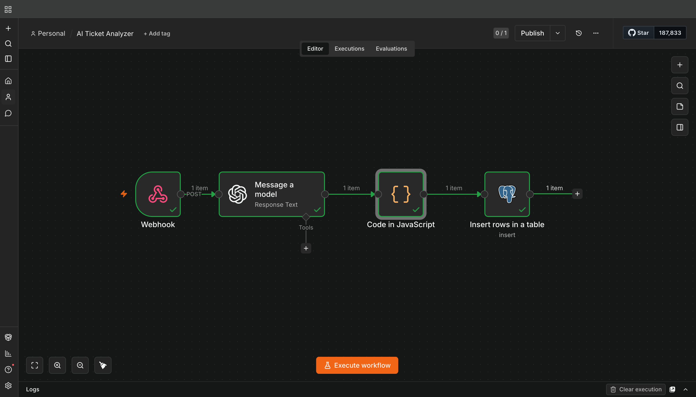
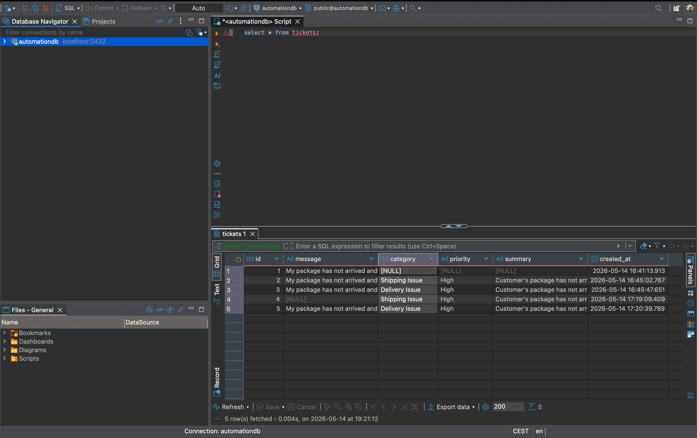
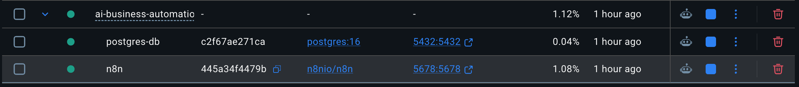

# AI Business Automation Platform

AI-powered workflow automation platform using n8n, PostgreSQL, Docker and OpenAI.

## Overview

This project analyzes customer support requests using AI and automatically stores structured ticket data in PostgreSQL.

The workflow uses OpenAI to classify support tickets by:
- category
- priority
- summary

The processed data is then stored in a PostgreSQL database for further analytics and reporting.

---

## Features

- AI-powered ticket analysis
- Priority detection
- Automatic categorization
- PostgreSQL data storage
- JSON processing
- Dockerized infrastructure
- Workflow automation with n8n

---

## Tech Stack

- n8n
- PostgreSQL
- Docker
- OpenAI API
- JavaScript

---

## Workflow Architecture

Manual Trigger  
↓  
Edit Fields  
↓  
OpenAI Analysis  
↓  
JSON Parser  
↓  
PostgreSQL Storage

---

## Example AI Output

```json
{
  "category": "Shipping Issue",
  "priority": "High",
  "summary": "Customer reports delayed package delivery."
}
```

---

## Future Improvements

- FastAPI backend
- React dashboard
- Power BI analytics dashboard
- Webhook/API integration
- Real-time analytics

---

## Setup

### Start containers

```bash
docker compose up -d
```

### Open n8n

http://localhost:5678

---

## Author

Niklas Ringeisen

---

## Screenshots

### Workflow



### Database



### Docker Containers

